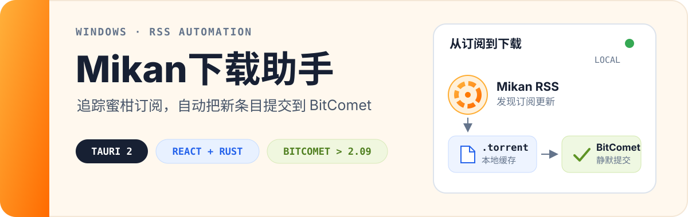

<p align="center">
  
</p>

<p align="center">
  <a href="../../releases/latest"><strong>下载最新版</strong></a>
  ·
  <a href="#快速开始">快速开始</a>
  ·
  <a href="#从源码运行">从源码运行</a>
</p>

Mikan下载助手是一款面向 Windows 的本地桌面工具。它定时读取你的 [蜜柑计划](https://mikanani.me/) RSS，在发现新条目后获取 `.torrent` 文件并静默提交到 [BitComet](https://www.bitcomet.com/en/downloads)，同时在一个界面里跟踪进度、处理失败任务和管理已提交的下载。

> [!IMPORTANT]
> 本项目不提供或托管任何内容。请只订阅、下载和分享你有权访问的内容，并妥善保管 RSS 地址中的个人 token。

## 从订阅到下载

```text
Mikan RSS → 发现新条目 → 获取 .torrent → 提交 BitComet → 同步进度与完成状态
```

配置完成后，应用可以常驻系统托盘工作：按设定间隔轮询订阅、跳过重复种子，并把新的下载任务交给 BitComet。你仍然可以随时手动刷新、暂停自动下载或单独处理某个条目。

## 主要功能

- **自动追踪订阅**：轮询间隔可设为 1–1440 分钟，也支持手动刷新和暂停自动下载。
- **BitComet 深度集成**：自动探测安装路径、校验版本，并以指定目录静默提交种子。
- **实时状态回读**：通过 BitComet WebUI 每 5 秒同步下载进度与完成状态。
- **任务控制**：支持提交、暂停、继续、重试、忽略、取消忽略，以及打开下载目录。
- **完整删除**：可同时删除 BitComet 任务、已下载文件和本地缓存的种子文件。
- **可靠去重**：解析 torrent `info_hash`，避免重复提交相同任务。
- **本地化运行**：配置、订阅状态与日志保存在本机；网络请求可选择直连或系统代理。
- **托盘常驻**：支持从托盘打开主界面、打开下载目录、切换开机自启动或退出应用。

## 快速开始

### 1. 准备 BitComet

安装 **高于 2.09 的 BitComet 版本**（即 2.10 或更新版本），然后在 BitComet 的 `设置 → 远程访问` 中启用 WebUI。实时进度、暂停、继续和删除操作依赖 WebUI；如果本机认证失败，可按 BitComet 的设置提示检查 WebUI 账号，或允许本机免登录。

### 2. 安装 Mikan下载助手

前往 [Releases](../../releases/latest) 获取最新版本：

- `Mikan下载助手-vX.Y.Z.exe`：安装版，面向整台电脑安装，运行时可能请求管理员权限。
- 便携版目录：直接运行 `Mikan下载助手.exe`，配置和日志保存在程序旁的 `data` 文件夹中。

### 3. 完成首次配置

打开应用的「配置」页，依次填写或选择：

1. 你的 Mikan RSS 地址，例如 `https://mikanani.me/RSS/MyBangumi?token=...`；
2. 实际存在的下载目录；
3. `BitComet.exe` 或 `BitComet_x64.exe` 的路径；
4. 直连或系统代理，以及合适的轮询间隔。

当 BitComet 状态显示「实时进度连接正常」后，返回「订阅」页点击「刷新订阅」。确认条目无误，再开启自动下载。

## 界面中的任务状态

| 状态 | 含义 |
| --- | --- |
| 新增 / 排队 | 已从 RSS 发现，等待处理 |
| 种子 | 正在获取并解析 `.torrent` |
| 下载中 | 已提交 BitComet，并在同步进度 |
| 暂停 | BitComet 任务已暂停 |
| 完成 | BitComet 报告完成，且本地目标存在 |
| 删除 | 原下载目标已不存在，或任务已被删除 |
| 忽略 | 不自动处理该条目，可随时取消忽略 |
| 失败 | 最近一次处理失败，可查看原因并重试 |

## 数据与隐私

- 安装版使用系统应用数据目录；便携版使用程序旁的 `data` 目录。
- RSS 地址可能包含个人 token。运行日志会尽量遮蔽敏感参数，但配置页和状态文件仍需要显示或保存完整地址，请勿截图公开配置页或上传整个数据目录。
- `.torrent` 会缓存在本地数据目录中，用于状态恢复和任务管理。
- BitComet WebUI 只通过本机地址连接；请不要为了排错而把 WebUI 暴露到不受信任的网络。
- 「删除任务和文件」是不可撤销操作，执行前请确认选中的条目和下载目录。

## 常见问题

<details>
<summary><strong>无法自动找到 BitComet</strong></summary>

确认使用的是高于 2.09 的版本，然后在配置页手动选择包含 `BitComet_x64.exe` 或 `BitComet.exe` 的目录。其他文件名不会被识别。

</details>

<details>
<summary><strong>BitComet 路径有效，但没有实时进度</strong></summary>

在 BitComet 的 `设置 → 远程访问` 中启用 WebUI，并检查端口、账号和本机访问权限。Mikan下载助手会优先读取 BitComet 配置中的 WebUI 端口，并只连接 `127.0.0.1`。

</details>

<details>
<summary><strong>刷新后有新条目，但没有自动提交</strong></summary>

检查「自动下载」是否已开启，并确认 RSS 地址、下载目录和 BitComet 路径均有效。失败原因会显示在条目下方，并写入「日志」页。

</details>

## 从源码运行

开发环境需要 Windows、[Node.js 20+](https://nodejs.org/) 和 Rust。Tauri 在 Windows 上还依赖 Microsoft C++ Build Tools 与 WebView2，完整准备步骤见 [Tauri prerequisites](https://v2.tauri.app/start/prerequisites/)。

克隆仓库并进入项目目录后运行：

```powershell
npm ci
npm run dev
```

常用命令：

| 命令 | 用途 |
| --- | --- |
| `npm run dev` | 启动 Tauri 开发环境 |
| `npm run dev:web` | 仅启动 Vite 前端 |
| `npm run typecheck` | 检查 TypeScript 类型 |
| `npm test` | 运行类型检查与 Rust 测试 |
| `npm run build` | 构建应用与 NSIS 安装包 |
| `npm run release` | 生成安装版与本地便携版发布目录 |

## 技术栈

- [Tauri 2](https://tauri.app/)：桌面窗口、系统托盘与 Windows 安装包
- Rust：RSS、torrent、BitComet WebUI、本地状态与后台轮询
- React 19 + TypeScript：桌面界面
- Vite：前端开发与构建

## 项目结构

```text
src/web/                 React 界面
src-tauri/src/           Rust 核心逻辑
src-tauri/windows/       NSIS 安装器与钩子
scripts/build-release.ps1  本地发布脚本
assets/                  应用图标与 README 资源
```

## 参与贡献

欢迎提交 Issue 或 Pull Request。修改前请先运行 `npm test`；应用行为发生变化时，请同步更新版本号并重新生成本地发布构建。

## 许可证

本项目采用 [MIT License](./LICENSE) 开源。

<p align="center"><sub>Designed by CaptainRuby</sub></p>
